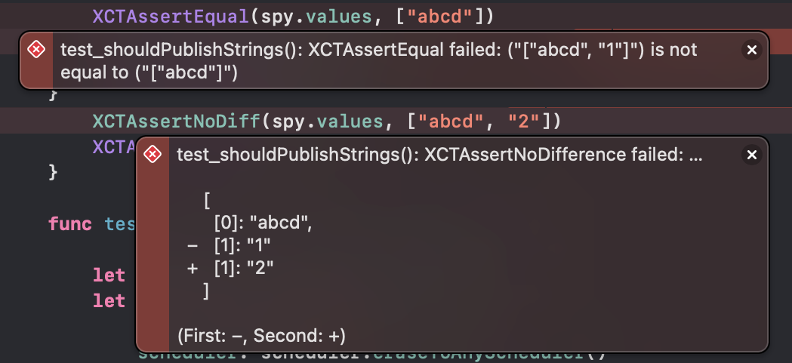

# ContainThirdPartyDependencies

Exploring a way to contain third-party dependencies.

## Goal

- Reduce `import`'s of third-party dependencies: do not pollute codebase and do not over-couple it with third-party dependencies.


## Solution

Use dedicated files within modules to import third-party dependencies and use various techniques to adapt:

- type-aliases,
- static methods or properties.

In case a decision to remove dependency is made it would be easier to swap implementation contained in one file.


## Notes

`CustomDump` with `XCTAssertNoDifference` that uses `customDump` is quite handy and really shines with complex types, but even in a simple case of array of strings it's much easier to read and spot the difference.

```diff
test_shouldPublishStrings(): XCTAssertEqual failed: ("["abcd", "1"]") is not equal to ("["abcd"]")
```

```diff
test_shouldPublishStrings(): XCTAssertNoDifference failed: …

    [
      [0]: "abcd",
  −   [1]: "1"
  +   [1]: "2"
    ]

(First: −, Second: +)
```
    

