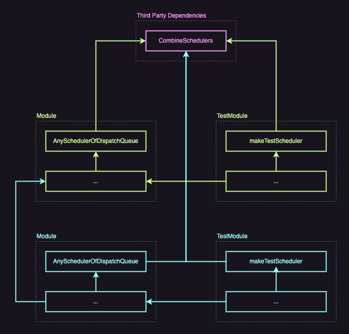

# ContainThirdPartyDependencies

Exploring a way to contain third-party dependencies.

## Goal

- Reduce `import`'s of third-party dependencies: do not pollute codebase and do not over-couple it with third-party dependencies.

## Solution

Use dedicated files within modules to import third-party dependencies and use various techniques to adapt:

- type-aliases,
- static methods or properties.

In case a decision to remove dependency is made it would be easier to swap implementation contained in one file.

